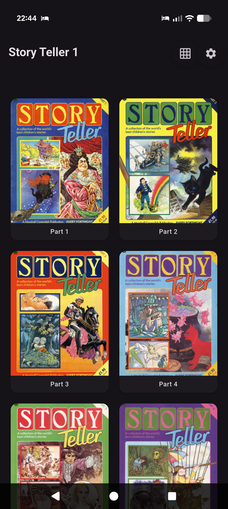
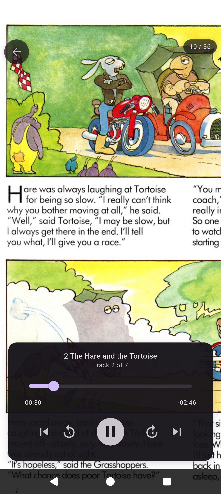

# Storyteller App

A tablet-friendly Android and iOS app for reading PDFs while listening to audio, built with Flutter. Inspired by the Story Teller children's magazine series from the 1980s. This app does not contain copyrighted content.

<p align="center">
  &nbsp;
  
</p>

## Story wut?

Story Teller was a British children's magazine published fortnightly starting in December 1982. Each issue came with a cover-mounted cassette tape containing professionally narrated readings of the stories, complete with music and sound effects.

The collection included a mix of:
- Traditional folk tales (like "Anansi the Spiderman")
- Classic children's stories (like Gobbolino, the Witch's Cat)
- Contemporary works written for the series (like "Timbertwig")
- Poems and verses

Longer stories were serialized across multiple issues. Pinocchio was the longest serial, spanning seven installments. Other serialized classics included Peter Pan and The Wizard of Oz.

## About This App

### Adding Content

I'm not affiliated with either of these links (I found them via Google).

- <a href="https://tinyurl.com/3er9ak39">Magnet</a> download
- [Mega](https://mega.nz/#F!r4pBADaK!hJUyak2JvM_D5TB3ohtKUQ) download

1. Download the MP3s and PDFs to your tablet device. 
1. Update [story_manifest.yaml](story_manifest.yaml) to match the file locations. 
1. Save the `story_manifest.yaml` in the same folder as the content on your device.
1. In the app settings, add the `story_manifest.yaml`.

## Development

1. Install Flutter: https://docs.flutter.dev/get-started/install
2. Clone this repository
3. Run `flutter pub get`
4. Run `flutter run`

### Building

```bash
# Android APK
flutter build apk

# iOS
flutter build ios

# macOS
flutter build macos
```
